# 🚀 CI/CD Pipeline for CodingNexus

## Overview

This project includes a complete CI/CD pipeline using GitHub Actions that automatically tests, builds, and deploys your application to your server.

## 📁 CI/CD Files Created

```
.github/
├── workflows/
│   ├── ci.yml              # Continuous Integration
│   ├── deploy.yml          # Direct SSH deployment
│   └── deploy-docker.yml   # Docker-based deployment
├── ACTIONS_GUIDE.md        # Quick reference guide
└── SETUP_CHECKLIST.md      # Setup checklist

CI_CD_SETUP.md              # Detailed documentation
deploy.sh                   # Quick deployment script
ecosystem.config.js         # PM2 configuration
docker-compose.yml          # Docker Compose setup
Dockerfile                  # Docker build configuration
nginx.conf                  # Nginx configuration
.env.production.example     # Environment template
.dockerignore              # Docker ignore rules
```

## 🎯 What the Pipeline Does

### CI Workflow (Continuous Integration)
Runs on every push/PR to `main` or `develop`:
- ✅ Lints code with ESLint
- ✅ Builds frontend with Vite
- ✅ Tests backend with PostgreSQL
- ✅ Runs security audit
- ✅ Uploads build artifacts

### CD Workflow (Continuous Deployment)
Runs on push to `main`:
- ✅ Connects to your server via SSH
- ✅ Pulls latest code
- ✅ Installs dependencies
- ✅ Runs database migrations
- ✅ Builds application
- ✅ Restarts services
- ✅ Verifies deployment

## 🚀 Quick Setup (5 Minutes)

### 1. Add GitHub Secrets

Go to: **Your Repository → Settings → Secrets → Actions → New secret**

Add these 6 secrets:

| Secret Name | Example Value | Description |
|------------|---------------|-------------|
| `SERVER_HOST` | `192.168.1.100` | Your server IP or domain |
| `SERVER_USER` | `ubuntu` | SSH username |
| `SSH_PRIVATE_KEY` | `-----BEGIN OPENSSH...` | SSH private key |
| `APP_DIRECTORY` | `/var/www/codingnexus` | App path on server |
| `DEPLOYMENT_URL` | `https://yourdomain.com` | Your app URL |
| `VITE_API_BASE_URL` | `https://api.yourdomain.com` | Backend API URL |

### 2. Generate SSH Key (if needed)

```bash
# Generate key
ssh-keygen -t ed25519 -C "github-actions" -f ~/.ssh/github_deploy

# Copy to server
ssh-copy-id -i ~/.ssh/github_deploy.pub user@server-ip

# Get private key for GitHub Secret
cat ~/.ssh/github_deploy
```

### 3. Prepare Your Server

```bash
# Install Node.js 20
curl -fsSL https://deb.nodesource.com/setup_20.x | sudo -E bash -
sudo apt-get install -y nodejs

# Install PM2
sudo npm install -g pm2

# Clone repository
git clone https://github.com/yourusername/CodingNexus.git /var/www/codingnexus
cd /var/www/codingnexus

# Create environment file
cp .env.production.example .env.production
nano .env.production  # Edit with your values
```

### 4. Test It!

```bash
# Push to main branch
git add .
git commit -m "Setup CI/CD pipeline"
git push origin main

# Watch deployment in GitHub Actions tab
# Your app will automatically deploy! 🎉
```

## 📊 Deployment Methods

### Method 1: Direct Deployment with PM2 (Recommended)
- Uses `deploy.yml` workflow
- Deploys directly to server via SSH
- Managed by PM2 process manager
- Fast and efficient
- Best for VPS/dedicated servers

### Method 2: Docker Deployment
- Uses `deploy-docker.yml` workflow
- Containerized application
- Includes PostgreSQL in container
- Better isolation
- Best for cloud platforms

## 🔧 Manual Deployment

If you prefer manual control:

```bash
# SSH into server
ssh user@your-server

# Navigate to app
cd /var/www/codingnexus

# Run deployment script
./deploy.sh
```

## 📝 What Happens on Each Push

```mermaid
graph LR
    A[Push to GitHub] --> B[CI: Build & Test]
    B --> C{Tests Pass?}
    C -->|Yes| D[CD: Deploy]
    C -->|No| E[Notify Failure]
    D --> F[Pull Code]
    F --> G[Install Dependencies]
    G --> H[Run Migrations]
    H --> I[Build Frontend]
    I --> J[Restart App]
    J --> K[Health Check]
    K -->|Pass| L[Success ✅]
    K -->|Fail| M[Rollback ❌]
```



## 🎛️ Managing Deployments

### View Workflow Status
1. Go to **Actions** tab in GitHub
2. See all workflow runs
3. Click any run to see details

### Manual Deployment
1. Go to **Actions** tab
2. Select "CD - Deploy to Server"
3. Click **Run workflow**
4. Choose branch (usually `main`)
5. Click **Run workflow**

### Check Application Status

```bash
# PM2 deployment
pm2 status
pm2 logs codingnexus

# Docker deployment
docker-compose ps
docker-compose logs -f app
```

### Rollback to Previous Version

```bash
ssh user@server
cd /var/www/codingnexus
git reset --hard HEAD~1
./deploy.sh
```

## 🔒 Security Best Practices

- ✅ Never commit `.env.production`
- ✅ Use dedicated SSH keys for deployment
- ✅ Rotate secrets regularly
- ✅ Enable firewall on server
- ✅ Use HTTPS with SSL certificates
- ✅ Keep dependencies updated
- ✅ Review GitHub Actions logs

## 🐛 Troubleshooting

### Deployment Fails

1. **Check GitHub Actions logs**
   - Go to Actions tab → Click failed workflow → View logs

2. **Check server resources**
   ```bash
   df -h        # Disk space
   free -h      # Memory
   pm2 status   # Application status
   ```

3. **Check application logs**
   ```bash
   pm2 logs codingnexus --lines 100
   ```

### Common Issues

| Issue | Solution |
|-------|----------|
| "Permission denied" | Check SSH key in GitHub Secrets |
| "Cannot connect to server" | Verify SERVER_HOST and firewall |
| "Health check failed" | Check if app is running: `pm2 status` |
| "Database error" | Verify DATABASE_URL in .env.production |
| "Build failed" | Check build logs in GitHub Actions |

## 📚 Documentation

Detailed guides available:

1. **[SETUP_CHECKLIST.md](.github/SETUP_CHECKLIST.md)** - Step-by-step setup
2. **[CI_CD_SETUP.md](CI_CD_SETUP.md)** - Complete documentation
3. **[ACTIONS_GUIDE.md](.github/ACTIONS_GUIDE.md)** - GitHub Actions reference
4. **[DEPLOYMENT.md](DEPLOYMENT.md)** - Original deployment guide

## 🎉 Benefits

- ✅ **Automated Testing** - Catch bugs before deployment
- ✅ **Fast Deployment** - Push and forget
- ✅ **Rollback Support** - Easy to revert changes
- ✅ **Zero Downtime** - PM2 handles graceful restarts
- ✅ **Health Checks** - Automatic verification
- ✅ **Security Audits** - Automated dependency checks
- ✅ **Consistent Builds** - Same process every time

## 🆘 Support

If you encounter issues:

1. Check [SETUP_CHECKLIST.md](.github/SETUP_CHECKLIST.md)
2. Review GitHub Actions logs
3. Check server logs
4. Verify all secrets are set correctly

## 📞 Quick Commands Reference

```bash
# View deployment status
pm2 status

# View logs
pm2 logs codingnexus

# Restart app
pm2 restart codingnexus

# Stop app
pm2 stop codingnexus

# Deploy manually
./deploy.sh

# Check health endpoint
curl http://localhost:5000/api/health
```

---

**Ready to deploy?** Follow the [SETUP_CHECKLIST.md](.github/SETUP_CHECKLIST.md) to get started!
